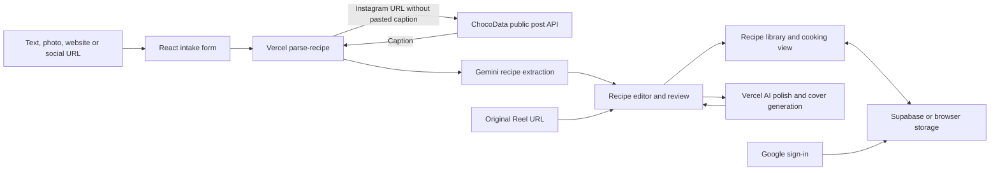

# Instagram imports in MISE

MISE is a personal recipe library. React/Vite supplies the intake forms, editor,
library and cooking views. Server-side Vercel functions use Gemini to turn source
material into recipe JSON, polish recipes and generate covers. Supabase provides
Google sign-in, account-owned recipes, favorites/progress and cover storage;
browser storage supports local use and recovery. Imported recipes enter the
editor for review before saving.

## Why Meta credentials did not fix it

The previous importer fetched Instagram HTML anonymously from the server and
looked for Open Graph tags. Instagram may return a login page or no caption.
Neither `INSTAGRAM_ACCOUNT_ID` nor `INSTAGRAM_API_KEY` was read by that code.

Meta's Instagram APIs primarily serve connected Business/Creator accounts.
Facebook Login also offers limited discovery of other professional accounts,
but it is not an arbitrary-public-post-URL caption API. Creating a developer
account does not grant that access. An App Secret is not a user access token.
The Meta variables are not used by this integration.

## ChocoData setup

1. Create a free account at <https://chocodata.com/> and obtain its API key.
2. Add `CHOCODATA_API_KEY=...` to `.env.local`. Keep `GEMINI_API_KEY` there too.
   Never give either secret a `VITE_` prefix.
3. For the deployed app, add `CHOCODATA_API_KEY` in the MISE Vercel project's
   environment variables and redeploy. Local changes do not update production.
4. Paste a public Instagram `/p/`, `/reel/` or `/tv/` URL in the social importer,
   leave the caption empty and select **Extract & Embed**.
5. Check the extracted ingredients and steps in the editor before saving.

ChocoData advertises 1,000 free requests **once**, not every month (checked
2026-09-14). Do not enable a paid subscription or top-ups if you want to stay
within the free allowance. MISE does not subscribe, purchase credits, or retry
failed lookups automatically. Account billing is controlled in ChocoData.

`npm run dev` starts only Vite and does not serve the `api/` functions. Use a
Vercel-compatible local API runtime (for example `vercel dev` for the linked
project), or test a deployment with both server-side keys configured. Do not
overwrite your custom `.env.local` when pulling deployment variables.

## Request and failure behavior

- One server-side GET to `https://api.chocodata.com/api/v1/instagram/post`, with
  `shortcode` extracted from the validated URL and `api_key` from server config.
- The response must be a flat post object with the matching `shortcode`, matching
  URL if supplied, and a nonempty `caption`. A profile, generic title, or error
  response is not recipe input. Reel support uses its shortcode. On 2026-09-14,
  a live local import of `CvvEAHStYXS` succeeded through ChocoData and Gemini,
  returning Ube Matcha Latte with six ingredients, four steps and its Reel URL.
- Provider requests time out after 20 seconds. Redirects are disallowed so a
  token-bearing request cannot follow an unexpected destination. Provider errors
  are replaced with safe messages; tokens and raw response bodies are not logged.
- A pasted caption skips all scraping, saves a provider request and remains usable
  if the free allowance runs out. Gemini extraction still uses its existing quota.
- Missing configuration, provider errors, rate/usage limits and unavailable posts
  return `requiresCaption: true`. Gemini is not called with an empty Instagram
  caption. Recipe-empty AI output also prompts for more source text.
- The saved Reel link is canonicalized and tracking parameters are removed.
  The caption provider's media URLs are not stored as durable artwork.

The free fallback is opening the Instagram post and pasting its recipe caption.
This integration extracts caption text; it does not watch or transcribe the Reel.

## Sources

- [Meta's official Instagram API collection](https://www.postman.com/meta/instagram/folder/9cgqucg/instagram-api-with-facebook-login)
- [ChocoData endpoint reference: instagram.post](https://chocodata.com/docs/endpoint-reference)
- [ChocoData authentication](https://chocodata.com/docs/guides/authentication)
- [ChocoData free allowance and pricing](https://chocodata.com/)
